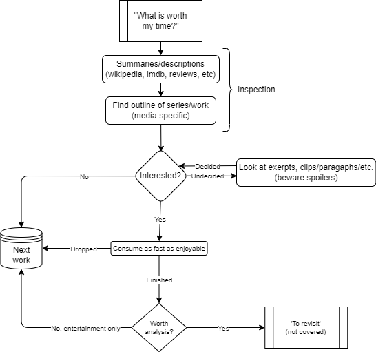
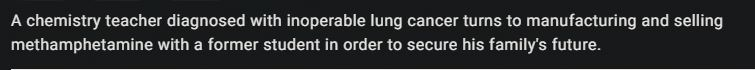
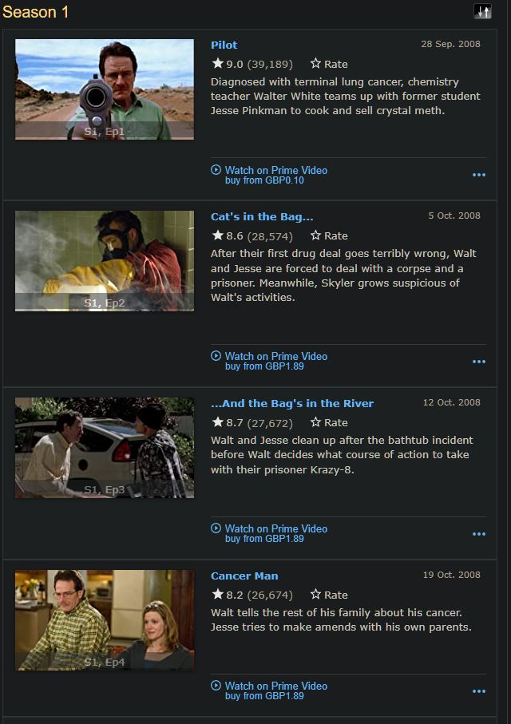
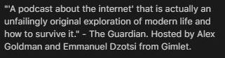
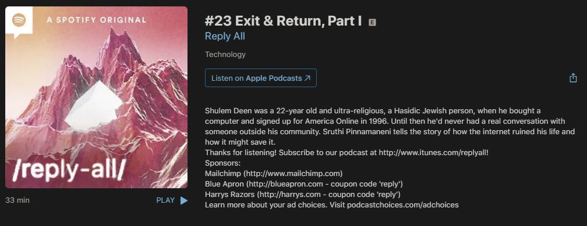

# How to optimise time spent on content in the [Information Era](https://en.wikipedia.org/wiki/Information_Age) (WIP)

[TL;DR](#tldr)

It is a known issue that we live in an age where the sheer amount of content that is produced far outweighs the ability for any one individual to consume it all. 

This is hardly a new problem - one could argue that the invention of the printing press was merely the start; but in the past, curation was *automatic* - what books, films or plays you enjoyed were entirely dependant on your access to resources, your nationality and social status. Now, assuming an internet connection, the main limit is your capacity for information.

This puts most people in the first and second-world in a bit of a mess:

- *["How do I find new content?"](#how-do-i-find-new-content)*
- *["What is worth my time?"](#what-is-worth-my-time)*
- *["How can I curate my feeds?"](#how-can-i-curate-my-feeds)*
- *["How do I consume content faster?"](#how-do-i-consume-content-faster)*

###### A small note on *discovery* versus *searching*

Gratuitously paraphrasing [Seth Godin](https://seths.blog/2014/04/search-vs-discovery/) here:

> [Searching] is what we call the action of knowing what you want and questing until you ultimately find it[...]
> 
> Discovery, on the other hand, is what happens when [...] you encounter something you didn't even know that you were looking for.

We'll give *searching* the time of day, at least, but know that we're mainly focusing on *discovery* here, since finding worthwhile content is a *"known unknown"* type of situation; it definitely exists, but we don't know how much, where, and to what extent.

If you're *searching*, here's the lightning round:

- Gwern appears to have written the [definitive guide on finding things](https://gwern.net/search) for the most part.
- Browsers allow adding *site-specific* search engines, such that they can be used through the omnibar. `%s` is the typical placeholder for 'the query'.
  - Beware that your query is prone to URI encoding. This might limit some searches (JQL queries come to mind).
- *Brave Search* supports the use of *[goggles](https://search.brave.com/help/goggles)* to alter page ranking.
  - This is useful if you *kind of know* what sites are likely to give the correct answer, so that useful info can float to the top.
- If you just want to *know the answer to a question*, [LLMs](https://en.wikipedia.org/wiki/Large_language_model) are actually [surprisingly *good*](https://www.perplexity.ai/search/5c521682-2df5-4306-b9f4-81b206e81398?s=c), when the consequences of incorrect information aren't catastrophic:
  - [Perplexity.ai](https://www.perplexity.ai) is a good engine that cites its sources, if you're skeptical.
  - [Phind](https://www.phind.com/) is tailored for programming questions and allows custom up/downranking of domains, much like Brave.
  - Note that sometimes you might have to ask follow-up questions or skim-read a verbose response.

## "How do I find new content?"

This is hardly a difficult task, given that most of the internet's business model is built on the *[Attention Economy](https://en.wikipedia.org/wiki/Attention_economy)* - everyone wants to show you new things. In the context of discovery, there are generally a few types, though:

- [Recommender Systems](#recommender-systems) - *"because you liked/other users like..."*
- [Social Bookmarking Services](#social-bookmarking-services) - *Reddit/HN/etc. "Wisdom of the crowd"*
- [Word-of-Mouth](#word-of-mouth) - *Forums, Comments, etc.*
- [Trusted sources](#trusted-sources) - *Critics, Journalists, Tastemakers & Friends*

### [Recommender Systems](https://en.wikipedia.org/wiki/Recommender_system)

| Content Type | Service |
| :----------: | :-----: |
| User-created video | [YouTube](https://youtube.com) |
| TV/Movies | [Netflix](https://netflix.com), [Trakt](https://trakt.tv) |
| Games | [Steam](https://steampowered.com)[1]
| Music | [Last.fm](https://last.fm), [Spotify](https://spotify.com) |
| Books | [Goodreads](https://goodreads.com)[2] |

This type is mostly self-explanatory to anyone that is even remotely online - *based on your previous choices in regards to X, you might like Y*. The main issue with machine-learning algorithms like these is that they're optimised for keeping you on the service as long as possible - a metric known as 'retention'.

Typically, that equates to playing it safe - you get more of *what you like*, but it doesn't really challenge you to exit your comfort zone and get new ideas or tastes, because that's risky to 'retention'. 

Recommendation algorithms are also prone to *exploiting [cognitive biases](https://en.wikipedia.org/wiki/Cognitive_bias)* - the most well-known of these being the [negativity bias](https://en.wikipedia.org/wiki/Negativity_bias). If you want to learn about controversial topics, recommendation algorithms will only ever show you content that affirms your existing beliefs, regardless of rationality.

As such, recommendation algorithms are best fit for **one purpose only** - finding more **entertainment** of the same *style you already enjoy*. Be aware that this *is* a [filter bubble](https://en.wikipedia.org/wiki/Filter_bubble), and that you won't find more 'unique' things this way.

### [Social Bookmarking Services](https://en.wikipedia.org/wiki/Social_bookmarking)

| Content Type | Service |
| :----------: | :-----: |
| General | [Reddit](https://reddit.com) |
| Tech | [Hacker News](https://news.ycombinator.com) |
| Rationality/Philosophy | [LessWrong](https://lesswrong.com) |

In all cases, social bookmarking services involve users submitting content that they think is good. What is then presented to the user first might be manually curated by administrators ([Slashdot](https://slashdot.org)), or - more frequently - is based upon a system where other users can up or downvote content that they like or dislike ([Reddit](https://reddit.com), [HN](https://news.ycombinator.com))

On the whole, the latter, community-curated type are slightly better than [Recommender Systems](#recommender-systems), as you now have a wider 'pool' based on what the people enjoy. You can tell what is universally *loved*, universally *hated*, or controversial, but not always good reasons as to *why.*

Larger groups tend more towards mainstream opinion, and are better suited for determining what is popular in that demographic. Smaller groups provide niche opinions, but regardless of size, detailed insight is stifled by ranking systems - you should use online [Word-of-Mouth](#word-of-mouth) style discourse to seek that instead.

### Word-of-Mouth

This refers to content that is recommended by *unknown individuals* in the form of comments, posts, annotations, memes, or any other user-created content. You can mostly find this in the comments of a [social bookmarking/news site](#social-bookmarking-services), but commentary of that nature will typically be about the content at hand. More applicable would be forum or imageboard posts, since discussion can revolve around many topics.

User reviews of a piece of content is also applicable, but this mainly only really provides context as to why *some* people in a demographic like or dislike it; as such it may very well be shallow in nature.

Since an *individual* is providing their opinion, it *can* sometimes be a source of higher-quality recommendations, especially if it is in the form of an essay video or blog post that is in a high-effort format. If a single user is identified to have consistently high-quality discourse or taste, aim to follow their works or comments through something like RSS if possible; as such they can then become a [trusted source](#trusted-sources). Contrarily, if you come across someone with consistently awful takes, they can be a sign to [not consume that thing](#people-with-bad-taste).

### Trusted Sources

These should be your 'consistently good' sources; they can be content creators *themselves,* or merely people with tastes *similar* but not *identical* to yours, that are willing to let you know what they think of something - good or bad. This can be in the form of specific people within a larger organization, individual 'tastemakers' that provide in-depth reviews and opinions, or even personal friends.

Friends are also good sources, since you already share some familiarity; though for maximum efficacy you should at first only consider their suggestions worthwhile in regards to what you both enjoy (you might like the same movies but have entirely different music taste, for example).

Examples might include:

* Following Twitter or Reddit accounts that post good content
* Subscribing to YouTube channels
* Reading a review blog
* etc...
  
#### People with Bad Taste

<!-- What was that one episode of Cortex where Grey said Myke was almost in the 'never listen to their TV recommendations' pile? I want to refer to that here cause I think it's genuinely a decent idea to sometimes put people in the 'avoid their recs' category even if it can seem a little mean, but it was never the topic of the episode itself. -->

Sometimes people will consistently give recommendations to content that you dislike or find mediocre. In some cases this means that your time may have been wasted on it, but additionally they can be a good guideline to preemptively avoid things that are *just* subtle enough to not immediately seem unappealing until you try it.

A good rule of thumb; if an individual provides *three* bad or mediocre recommendations *in a row*, don't snub them; put their future recommendations on your silent 'do not consume' list and note what they enjoy so that you can avoid it. 

Of course, this cancels out based on your discretion (if something is wildly popular or other 'trusted' people like it).

## "What is worth my time?"

> ###### Some realisations before continuing
>
> There are three fundamental truths about the modern firehose of content:
>
> 1. You will *never* get to see it all in your lifetime.
> 2. There will always be things that were *not worth the time spent.*
> 3. It is easier to pick up old content than to *find new content.*
>
> As such, optimising requires a harsh mentality wherein you must be prepared to [cut your losses](https://en.wikipedia.org/wiki/Sunk_cost#Fallacy_effect) as soon as they are realised; time spent suffering through bad art is always more costly than the money spent to access it in the first place.

That said, there are two aspects to this problem:

1. Identifying what is worth your time *in the first place* (**[inspection](#inspection)**)
   - This can be somewhat filtered via [curation](#how-can-i-curate-content).
2. Realising what is - or *isn't* - worth *more* of your time (**[reflection](#reflection)**)

Your methods to identify this will vary based on type of media, and your subjective pet peeves. That said, Adler[@adlerHowReadBook1972](#references) suggests a book-specific process to consumption, simplified thus:

1. Identify the theme and structure of the book by reading [specific parts](#inspecting-a-book).
2. Consume the work as quickly as possible without marginalia or re-reading.
3. Analyze the work in detail. 
4. If researching a topic, tie your analysis of works together to map out discourse and reach your own conclusion.

Each step identifies a 'break point' at which to continue or cease spending more time on the work. 

> We will only cover the first two steps here[3](#footnotes) - this section focuses on the 1st. 

Given the above, here is a genericized flowchart as to the process when consuming something new:

We'll assume that during *[discovery](#a-small-note-on-discovery-versus-searching)* you identified that the work was at least worth initial inspection. 

### Inspection

Here you're trying to answer two questions:

1. What is the work about as a whole? 
   - *What genre is it, what's the main topic?*
2. What specific subthemes/points are there and how are they executed? 
   - *What social commentary, criticism or themes exist and how?*

In theory, having a rough set of answers here should indicate if this is a work you'd enjoy. If the content is small enough that you'd spend about the same time 'inspecting' it as consuming it, feel free to skip doing so and jump right in.

#### Some good telltale signs

##### TV, Movies, Plays and Shows

- Look into the director(s). Are you familiar with them? If so, do you like their other work?
  - Do the same for any notable actors, leads or hosts.

##### Music

- What do fans of this artist like?
- Is the genre of the album similar to those you already listen to?

### Reflection

You should aim to wonder whether you're still enjoying something after each demarquated 'chunk' of content. This is hard for some things, but some general rules of thumb are provided below:

- Every episode of a series, and (if applicable) every season.
- Each chapter of a book, or issue of a serial.
- Each song of an album, or album of a band.
- Each level or chapter in a videogame.

Realistically, these 'marked' points will be more or less visible from work to work. Hueristics can be a good approximation:

- Note any annoyances and consider dropping it preemptively if these are recurring.
- If you start *losing interest*, end your session. Put consistently unengaging works on the backburner.
- If at any point you explicitly think 'this is bad' - and *not* 'so-bad-it's-good' - **drop it immediately.**

When any of these 'red flags' appear, mentally track them. If you drop something altogether, you should *physically* note why; these can help you see patterns in your tastes, and - if they change - can indicate if you should give something another chance.

#### Examples of Inspection

#### Books

*Inspecting* a book - according to Adler - should involve you skimming the following for details, in order:
1. Preface
2. Table of Contents
   - *What chapters seem important?*
3. Index
4. Inside jacket/blurb
   - *This is the 'elevator pitch' of the book.*
5. Short exerpts no longer than 1-2 paragraphs.
   - *The start and end of the book, and any chapter summaries thereof.*

If you're not enjoying a book, you might want to give it either 3 annoyances per session or until the next chapter to sort itself out.

#### TV/Video Series

We'll give an example of inspection using [IMDB](https://imdb.com) and *Breaking Bad* as a reference:

1. Read the show description and watch any trailers:

> 

2. Start reading some of the episode summaries across seasons:
   - Additionally (if these exist) also read any summaries of the seasons themselves.

>  

3. **If you don't mind spoilers**, begin skimming through some of the early episodes to assess quality.

Consider dropping a series if you come across more than **three** episodes that are bad in a *single season.* Adjust this to taste, considering episode length, number of seasons, etc.

#### Movies

Similar to [TV](#tvvideo-series):

1. Read any summaries and watch any trailers provided.
2. Note reviews and comments by people who have watched it previously.
3. Begin looking for scenes of the film on video sharing sites if applicable.

Films lack segments like other media, so you must [be self-aware](#reflection) to determine your opinion of the film as it progresses. On the plus side, they tend to be easier to pick back up, so drop bad ones with reckless abandon.

#### Podcasts, Radio, Audiobooks \& Other Aural Works

We'll use [Reply All](https://podcasts.apple.com/gb/podcast/reply-all/id941907967) as an example:

1. Read the podcast/radio summary or any other information:
  

2. Start reading some of the episode summaries.
  

3. Start watching through any episodes that interest you based on the synopsis provided.

If you're listening to a show and are starting to consider dropping it:

- If you are watching episodes, broadcasts or chapters to evaluate the content in the first place, set a timer for 5 minutes (or the sped-up equivalent). Re-evaluate whether to drop it after the timer elapses.
- If you've been following for a while, give it a few more episodes and drop it if it does not improve.

Evaluate audiobooks and audiodramas by inspecting their original sources. When deciding whether to drop one or not, use chapters and acts as reflection points in lieu of episodes.

#### Dramas and Musicals

1. Look up the leads of the performance.
2. Read any general opinions on the production by people that have already seen it.
3. If bootlegs exist for the drama/show, go and watch them to see if you'd want to see it in person.
   - If it's a musical, listen to the soundtrack also.

## "How can I curate my feeds?"

## TL;DR

- Use *[recommendation algorithms](#algorithmic-recommendations)* to find more of *what you already like.*
  - Beware [filter bubbles](https://en.wikipedia.org/wiki/Filter_bubble).
- Use *[consensus-based recommendations](#consensus-based-recommendations)* to find what *other people* like, hate or *can't agree on.*
  - Beware of [echo chambers](https://en.wikipedia.org/wiki/Echo_chamber_(media)).

# References

\[@adlerHowReadBook1972]: 

# Footnotes

[1]: *Games must be played through service*
[2]: *Requires reviewing 20 books first.*
[3]: Adler's description of the 3rd and 4th steps are superbly written, but ultimately encourage an extremely systematic and dry approach that - in the author's opinion - breaks down somewhat outside of the rationalist world of non-fiction.